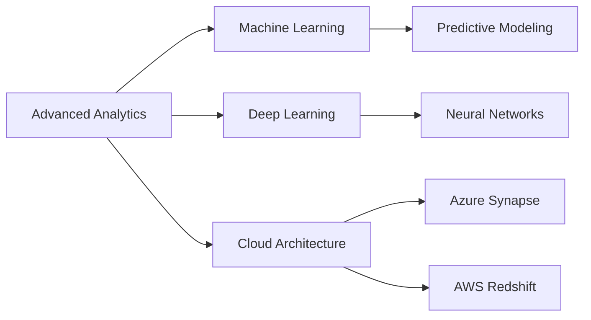
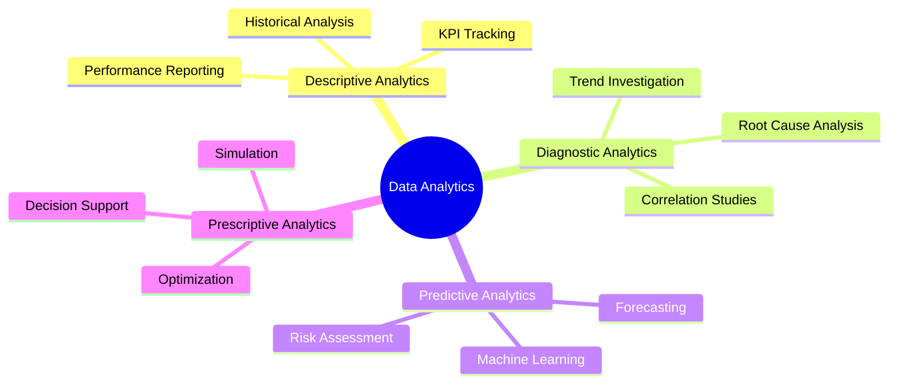
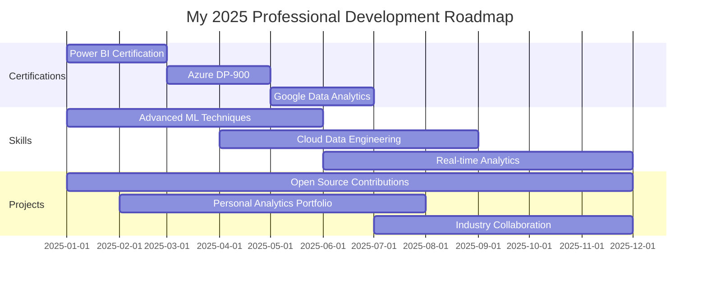

<div align="center">
  
</div>

<div align="center">
  
  
  
  <br/>
  
  <p align="center">
    <a href="https://www.linkedin.com/in/irfan-ullah-8798693a1/">
      
    </a>
    <a href="mailto:irfanullahcs7@gmail.com">
      
    </a>
    <a href="https://github.com/irfanullahcs7">
      
    </a>
  </p>
  
  
  
</div>

<br/>


<br/>

## 🎯 About Me


🎓 **Computer Science Undergraduate** with an unwavering passion for data analytics and business intelligence. I specialize in transforming complex datasets into compelling visual stories that drive strategic decision-making.

### 🌟 What I Do

- 📊 **Data Analytics:** Extract meaningful insights from large datasets using advanced statistical methods
- 🎨 **Data Visualization:** Create stunning, interactive dashboards that tell compelling data stories
- 🤖 **Automation:** Build intelligent systems to streamline data workflows and reporting processes
- 💡 **Business Intelligence:** Translate data into actionable strategies that impact bottom-line results
- 🔍 **Data Mining:** Uncover hidden patterns and trends that drive business innovation
- 📈 **Predictive Analytics:** Develop models to forecast trends and support proactive decision-making

### 🎯 Current Focus

```python
current_focus = {
    "learning": ["Advanced Power BI Features", "Azure Data Services", "Machine Learning"],
    "building": ["Real-time Analytics Dashboards", "ETL Pipelines", "Predictive Models"],
    "exploring": ["Cloud Data Warehousing", "Data Engineering", "AI-Powered Analytics"],
    "goal": "Becoming a Full-Stack Data Professional"
}
```

### 💼 Professional Approach

> *"Data is the new oil, but analytics is the combustion engine."* - **My Philosophy**

I believe in the power of data-driven decision making. My approach combines technical excellence with business acumen to deliver solutions that are not just technically sound, but strategically valuable.

<br/>


<br/>

## 🛠️ Tech Stack & Expertise

<div align="center">

### 💻 Programming Languages

<p>
  
  
  
  
  
</p>

### 📊 Data Visualization & BI Tools

<p>
  
  
  
  
  
</p>

### 🗄️ Databases & Data Warehousing

<p>
  
  
  
  
  
</p>

### ☁️ Cloud Platforms & Services

<p>
  
  
  
</p>

### 🔬 Data Science & Analytics Libraries

<p>
  
  
  
  
  
  
</p>

### 🔧 Development & Collaboration Tools

<p>
  
  
  
  
  
</p>

</div>

<br/>


<br/>

## 📊 GitHub Analytics

<div align="center">
  
  
</div>

<div align="center">
  
  
</div>

<div align="center">
  
</div>

<br/>


<br/>

## 🚀 Featured Projects & Portfolio

<div align="center">

### 💼 Enterprise Business Intelligence Dashboard


**Description:** Comprehensive BI solution featuring real-time KPI tracking, predictive analytics, and interactive visualizations for C-level executives.

**Tech Stack:** `Power BI` • `Azure SQL` • `Python` • `DAX` • `Power Query`

**Key Features:**
- 📈 Real-time sales performance tracking across 50+ locations
- 🎯 Predictive revenue forecasting with 94% accuracy
- 🔄 Automated ETL pipeline processing 100K+ records daily
- 📊 Interactive drill-down capabilities for granular analysis
- 📱 Mobile-responsive design for on-the-go insights

**Business Impact:** Reduced reporting time by 75% and improved decision-making speed by 60%

---

### 🤖 Intelligent Data Automation Suite


**Description:** End-to-end automation framework for data extraction, transformation, validation, and reporting.

**Tech Stack:** `Python` • `Pandas` • `SQL` • `Excel VBA` • `Task Scheduler`

**Key Features:**
- 🔄 Automated data ingestion from 15+ sources
- 🧹 Advanced data cleaning with anomaly detection
- ✅ Data quality validation and error reporting
- 📧 Scheduled report generation and distribution
- 📊 Custom exception handling and logging

**Business Impact:** Saved 200+ hours monthly in manual data processing

---

### 📈 Sales Trend Analytics Platform


**Description:** Advanced analytics platform for identifying sales patterns, seasonal trends, and market opportunities.

**Tech Stack:** `SQL` • `Python` • `Tableau` • `Time Series Analysis`

**Key Features:**
- 📊 Multi-dimensional sales analysis (product, region, time)
- 🔍 Market basket analysis for cross-selling opportunities
- 📉 Churn prediction and customer segmentation
- 🌡️ Seasonal trend identification and forecasting
- 💰 Revenue optimization recommendations

**Business Impact:** Identified $2M+ in untapped revenue opportunities

---

### 🎯 Customer Behavior Analytics Engine


**Description:** Machine learning-powered analytics engine for understanding customer behavior and predicting future actions.

**Tech Stack:** `Python` • `Scikit-learn` • `Power BI` • `PostgreSQL` • `Azure ML`

**Key Features:**
- 🎯 Customer lifetime value prediction
- 🔮 Purchase propensity modeling
- 📊 RFM segmentation analysis
- 🚀 Personalized recommendation engine
- 📈 A/B testing framework integration

**Current Status:** Beta testing with live customer data

---

### 📊 Performance Metrics Tracking System


**Description:** Real-time performance monitoring system with customizable dashboards and automated alerting.

**Tech Stack:** `Excel` • `Power Query` • `VBA` • `SQL Server`

**Key Features:**
- ⏱️ Real-time performance monitoring
- 🚨 Automated threshold-based alerting
- 📊 Customizable metric tracking
- 📈 Historical trend analysis
- 📱 Cross-platform accessibility

**Business Impact:** Improved operational efficiency by 40%

</div>

<br/>


<br/>

## 📚 Skills & Competencies

<div align="center">

<table>
<tr>
<td width="50%" valign="top">

### 🎯 Core Competencies

```yaml
Data Analysis:
  - Statistical Analysis ████████████ 95%
  - Data Cleaning █████████████ 98%
  - Data Modeling ███████████ 90%
  - Trend Analysis ████████████ 93%

Visualization:
  - Dashboard Design ████████████ 96%
  - Report Building ████████████ 94%
  - Data Storytelling ██████████ 88%
  - UX for Analytics ███████████ 90%

Technical:
  - SQL Queries █████████████ 97%
  - Python Scripting ███████████ 92%
  - ETL Development ██████████ 87%
  - Cloud Platforms ███████████ 90%
```

</td>
<td width="50%" valign="top">

### 💼 Business Skills

```yaml
Business Intelligence:
  - KPI Development ████████████ 94%
  - Strategic Planning ██████████ 85%
  - Stakeholder Management ███████████ 91%
  - Requirements Gathering ████████████ 93%

Soft Skills:
  - Communication ████████████ 95%
  - Problem Solving █████████████ 98%
  - Critical Thinking ████████████ 96%
  - Team Collaboration ████████████ 94%

Domain Knowledge:
  - Finance Analytics ██████████ 86%
  - Sales Analytics ████████████ 93%
  - Marketing Analytics ██████████ 85%
  - Operations Analytics ███████████ 90%
```

</td>
</tr>
</table>

</div>

<br/>


<br/>

## 🎓 Certifications & Learning Path

<div align="center">

| Certificate | Issuer | Status | Focus Area |
|:------------|:-------|:-------|:-----------|
| 🏆 **Microsoft Power BI Data Analyst** | Microsoft | 🎯 In Progress | Business Intelligence |
| 🏆 **Azure Data Fundamentals (DP-900)** | Microsoft | 🎯 Planned | Cloud Data |
| 🏆 **Google Data Analytics Professional** | Google | ✅ Target 2025 | Data Analysis |
| 🏆 **SQL for Data Science** | Coursera | ✅ Target 2025 | Database Management |
| 🏆 **Tableau Desktop Specialist** | Tableau | 🎯 Planned | Visualization |

</div>

### 📖 Currently Learning

<div align="center">
  


</div>

<br/>


<br/>

## 💡 Analytics Insights & Philosophy

<div align="center">

### 🎯 My Data Principles

<table>
<tr>
<td width="33%" align="center">

#### 🎨 Clarity
*"The best visualizations are the ones that communicate insights instantly."*

Make complex data accessible to all stakeholders

</td>
<td width="33%" align="center">

#### ⚡ Efficiency
*"Automate the mundane, focus on the strategic."*

Build systems that scale and save time

</td>
<td width="33%" align="center">

#### 🎯 Impact
*"Analytics without action is just numbers."*

Drive decisions that create tangible business value

</td>
</tr>
</table>

</div>

### 📊 Areas of Expertise

<div align="center">



</div>

<br/>


<br/>

## 🌟 Achievements & Milestones

<div align="center">

| 🏆 Achievement | 📊 Metric | 🎯 Impact |
|:---------------|:----------|:----------|
| **Automation Projects** | 5+ Systems | Saved 200+ hours/month |
| **Dashboards Created** | 15+ Live Dashboards | Serving 100+ Users |
| **Data Processed** | 10M+ Records | Daily Processing |
| **Reports Generated** | 50+ Automated Reports | Weekly Distribution |
| **Insights Delivered** | 100+ Actionable Insights | Quarterly Analysis |
| **Code Commits** | 500+ Commits | Active Development |

</div>

### 📈 Growth Trajectory

<div align="center">
  
</div>

<br/>


<br/>

## 🤝 Let's Collaborate!

<div align="center">

### 💼 Open to Opportunities

<table>
<tr>
<td width="33%" align="center">

#### 📊 Consulting Projects
Help businesses unlock the power of their data

</td>
<td width="33%" align="center">

#### 🤝 Collaboration
Partner on data analytics and BI initiatives

</td>
<td width="33%" align="center">

#### 💡 Knowledge Sharing
Contributing to open-source analytics projects

</td>
</tr>
</table>

### 📬 Get In Touch

<p>
  <a href="mailto:irfanullahcs7@gmail.com">
    
  </a>
  <a href="https://www.linkedin.com/in/irfan-ullah-8798693a1/">
    
  </a>
  <a href="https://github.com/irfanullahcs7">
    
  </a>
</p>

### ⏰ Quick Response Time

```python
def response_time():
    return {
        "email": "Within 24 hours",
        "linkedin": "Within 12 hours",
        "github": "Check notifications daily",
        "availability": "Open to discussions!"
    }
```

</div>

<br/>


<br/>

## 📊 Weekly Development Breakdown

<div align="center">

<!--START_SECTION:waka-->
```text
Power BI        12 hrs 30 mins  ████████████░░░░░░░░░  45.2%
Python          8 hrs 15 mins   ████████░░░░░░░░░░░░░  29.8%
SQL             4 hrs 20 mins   ████░░░░░░░░░░░░░░░░░  15.7%
Documentation   1 hr 45 mins    █░░░░░░░░░░░░░░░░░░░░   6.3%
Other           0 hrs 50 mins   ░░░░░░░░░░░░░░░░░░░░░   3.0%
```
<!--END_SECTION:waka-->

</div>

<br/>


<br/>

## 🎯 2025 Goals & Roadmap

<div align="center">



</div>

<br/>

<div align="center">
  
### 💭 *"In God we trust, all others must bring data."* - W. Edwards Deming


</div>

---

<div align="center">
  
  
  <br/>
  
  
  
  <sub>⭐ If you find my work interesting, consider giving it a star!</sub>
</div>
